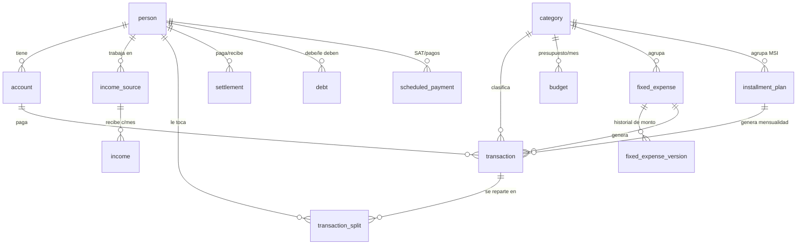

# Modelo de datos — App de Finanzas (Rober y Jime)

Base de datos relacional (**PostgreSQL**) para una **app web** accesible desde PC y celular.
Esquema completo en [schema.sql](schema.sql).

## Idea central

Cada **gasto** separa dos preguntas que tu Excel ya distingue:

1. **¿Con qué se pagó?** → la **cuenta/tarjeta** (`account`), y como cada tarjeta tiene
   dueño, de ahí sale *quién pagó*.
2. **¿A quién le toca?** → la **división** (`transaction_split`), que reparte el gasto
   entre Rober y Jime (100% de uno, o un porcentaje).

Con esas dos cosas se calcula solo:
- **Cuánto te queda disponible de tu salario** (ingreso − tu parte de los gastos).
- **Quién le debe a quién** (lo que pagaste − lo que te tocaba) → tus ajustes *"Jimena a Roberto"*.

## Diagrama

## Las tablas, en tus términos

| Tabla | Qué guarda | De tu Excel |
|---|---|---|
| `person` | Rober y Jime | las dos personas |
| `account` | Tarjetas y efectivo, con dueño y día de corte | desglose por banco + CORTES DE TARJETA |
| `income_source` | Tus trabajos y su sueldo fijo esperado | Salarios (SEP, RICHIT, Bachilleres…) |
| `income` | **Lo que realmente llegó cada mes** por trabajo | así registras "este mes llegó más/menos" |
| `category` | Las categorías (editables) | MESES SIN INTERESES, GASTOS FIJOS, GASOLINA… |
| `budget` | Presupuesto/"Permitido" de cada categoría **por mes** | PRESUPUESTO de TIPOS DE GASTOS |
| `transaction` | Cada gasto: fecha, categoría, monto, tarjeta, descripción | TABLA DE GASTOS EN TARJETAS Y EFECTIVO |
| `transaction_split` | Cómo se reparte cada gasto entre ustedes | el "dueño" del gasto + tus ajustes |
| `fixed_expense` (+`_version`) | Gastos fijos recurrentes y su **historial de monto** | Gastos Fijos / Entretenimiento / Salud |
| `installment_plan` | Meses sin intereses con **"cuándo termina"** | tabla Meses sin Intereses |
| `settlement` | Pagos reales de uno al otro para saldar | JIMENA A ROBERTO / ROBERTO A JIMENA |
| `debt` | Deudas que tienes y dinero por recuperar | Deudas Roberto + Recuperación de gastos |
| `scheduled_payment` | SAT y pagos con vencimiento (para avisos) | Pago SAT |

## Cómo se resuelven tus casos de uso

- **Sueldos fijos pero variables** → `income_source.expected_amount` es el fijo de
  referencia; `income` guarda el real de cada mes. La diferencia es la variación.
- **Gastos fijos que cambian, con historial** → `fixed_expense_version`: cada cambio de
  monto es una versión con fecha; nunca pierdes el histórico.
- **Gasolina y Comida como tope que se descuenta** → categoría con `budget_mode = 'cap'`;
  la vista `v_category_month` te da `remaining = presupuesto − gastado`.
- **Meses sin intereses con vida limitada** → `installment_plan.end_period` define cuándo
  deja de cobrarse; cada mes genera su mensualidad hasta esa fecha.
- **Dueño de cada gasto** → `transaction_split` (uno o ambos, con %).
- **Aviso de disponible del salario** → vista `v_person_available` (`available`).
- **Historial y gráficas** → todo va con `period` (mes), listo para series de tiempo.

## Vistas listas para el tablero

- `v_category_month` — Presupuesto vs Gastado vs Restante, por categoría y mes.
- `v_person_available` — Ingreso, gastado y **disponible** por persona y mes.
- `v_who_owes_whom` — Pagado vs lo que tocaba → **quién le debe a quién**.

---

### Dudas abiertas para la siguiente ronda
1. ¿Los trabajos (SEP, RICHIT, Bachilleres…) de quién son? ¿Algún sueldo es compartido?
2. Cuando un gasto es compartido, ¿el reparto típico es 50/50 o varía por categoría?
3. ¿Quieres un reparto por defecto por categoría (ej. Gasolina = 100% Rober) para no
   capturarlo cada vez?
